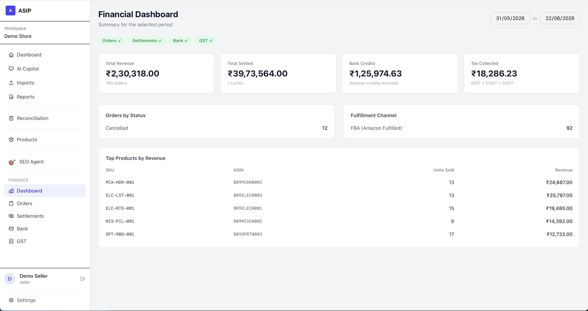
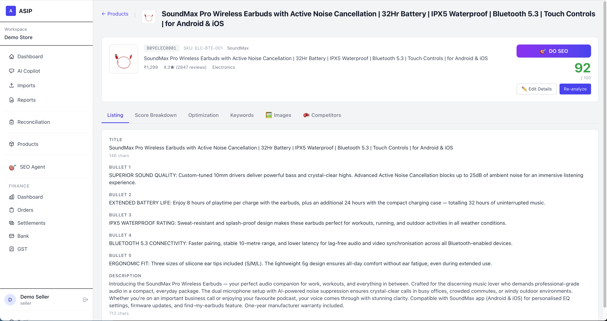
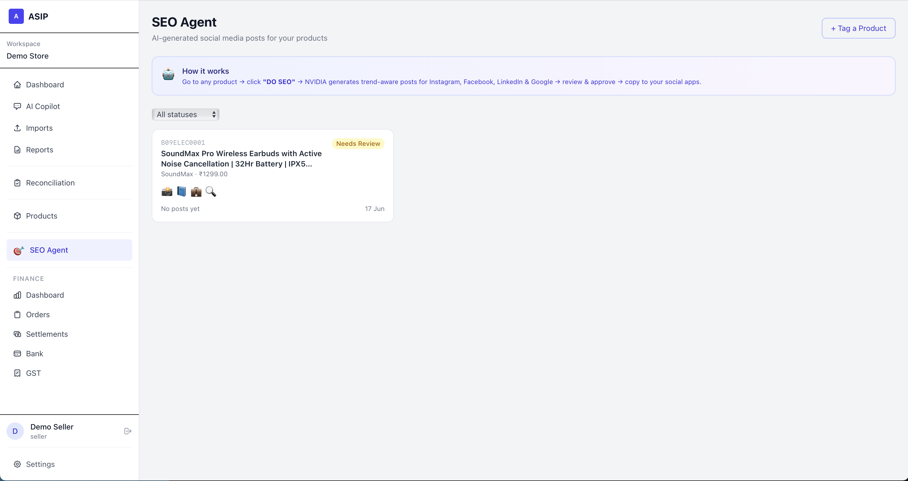
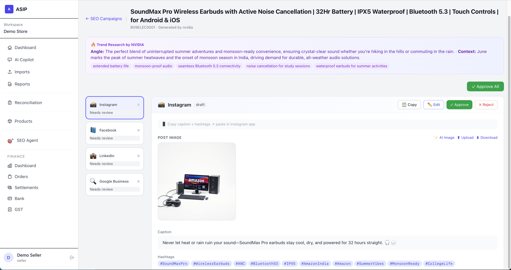
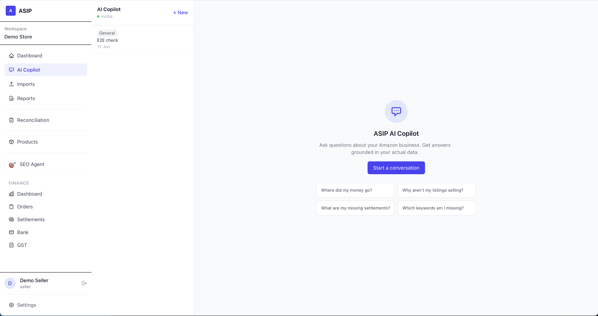
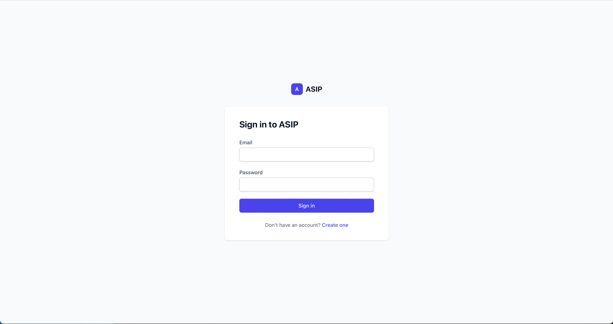
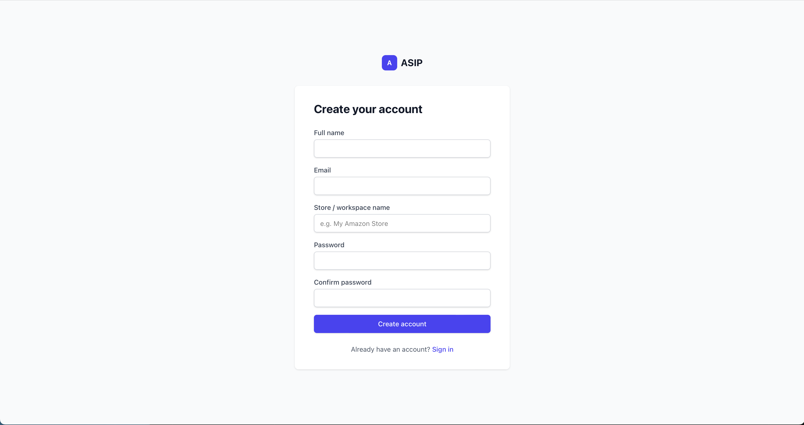

<div align="center">

# 🅰️ ASIP — Amazon Seller Intelligence Platform

### The AI-first command center for Amazon sellers — reconcile money, fix listings, outsmart competitors, and run an autonomous SEO agent.

**Built from uploaded data only (CSV + pasted HTML). No marketplace API. No scraping. No compliance risk.**

<br/>


</div>

---



---

## Why ASIP

Amazon sellers drown in spreadsheets and lose money to silent settlement gaps, weak listings, and guesswork marketing. ASIP answers the three questions that actually matter:

> 💰 **"Where did my money go?"** — automated order ↔ settlement ↔ bank ↔ GST reconciliation
> 📉 **"Why aren't my products selling?"** — AI listing scores, competitor keyword gaps, one-click rewrites
> 🚀 **"What should I do next?"** — an autonomous SEO agent that drafts & images social posts, plus a RAG copilot over *your* data

All from data you already have — upload a CSV or paste a page's HTML. Nothing leaves your control.

---

## ✨ Feature tour

### 📊 Financial reconciliation & dashboards
Match orders against settlements, bank credits, and GST filings; surface discrepancies; export CSV/PDF. Role-aware dashboards for sellers, accountants, and agencies.

### 🛍️ Listing intelligence


Every product gets an **AI listing score** (title, bullets, description, keywords, reviews) with prioritized, actionable fixes — and a **one-click AI rewrite** that's grounded in real competitor keyword gaps. Manage a full **multi-image gallery** with uploads *and* AI-generated product imagery (NVIDIA FLUX), reference-guided regeneration, reuse and revert.

### 🥊 Competitor intelligence
Add competitors per product via **CSV or pasted HTML**. ASIP benchmarks price/rating/reviews and computes **keyword gaps** (brand- and stop-word filtered) — then feeds them into the AI rewrite so your copy reflects what actually sells.

### 🎯 Autonomous SEO marketing agent


Tag a product → the agent researches trends, writes **platform-specific posts** for Instagram, Facebook, LinkedIn & Google Business, and generates matching imagery — then waits for your approval before anything publishes.



Edit every field (title, caption, hashtags), regenerate or upload images, reuse an image across platforms, or revert — all from one review screen.

### 🤖 AI Copilot (RAG)


Ask plain-English questions about your catalog and finances. Answers are grounded in *your* data via pgvector embeddings — not generic hallucinations.

---

## 🏗️ Architecture

A **modular monolith** — every domain is a self-contained module under `app/Modules/` with its own controllers, services, jobs, models, resources, routes, events and listeners.

```
Identity · Workspace · Imports · Finance · Reconciliation
Products · Competitors · AI · Reports · SEO · Settings
```

```
            ┌──────────────┐      ┌─────────────────────────┐
  Browser → │  nginx (TLS) │ →    │  Vue 3 SPA  ·  Sanctum   │
            └──────────────┘      │  session auth + RBAC     │
                                  └────────────┬────────────┘
                                               │  /api/v1
                                  ┌────────────▼────────────┐
                                  │   Laravel 13 (PHP-FPM)   │
                                  │   modular monolith       │
                                  └───┬───────────┬──────────┘
              CSV / HTML paste        │           │
        ┌────────────────────────────▼──┐   ┌─────▼──────────────────────┐
        │ PostgreSQL 16 + pgvector (HNSW)│   │ Redis + Horizon queues     │
        │ orders, settlements, products, │   │ imports · reconciliation · │
        │ embeddings, …                  │   │ ai · reports · embeddings  │
        └────────────────────────────────┘   └─────┬──────────────────────┘
        ┌────────────────────────────────┐         │  async jobs
        │ MinIO (S3) — uploads, exports, │ ◄───────┘
        │ generated images               │   AI: NVIDIA · Groq · Anthropic · OpenAI
        └────────────────────────────────┘
```

Heavy work (imports, reconciliation, AI generation, embeddings, reports) runs on **Horizon queues** so requests stay fast. Event-driven flows connect modules — e.g. `ImportCompleted` fans out to product analysis, competitor analysis, and embedding generation.

| Layer | Technology |
|-------|-----------|
| Backend | **Laravel 13**, PHP 8.4 |
| Frontend | **Vue 3** + TypeScript, Pinia, Vue Router, Tailwind CSS v4 (Vite) |
| Database | **PostgreSQL 16** + `pgvector` (HNSW index for RAG) |
| Queue / cache / sessions | **Redis** + Laravel Horizon |
| Object storage | **MinIO** (S3-compatible) |
| Auth | Laravel Sanctum (SPA) + Spatie Permission (RBAC) |
| AI | **NVIDIA NIM** (Nemotron text · FLUX images · Llama vision) primary; Groq / Anthropic / OpenAI fallbacks |
| Infra | Docker Compose (8 services) |

---

## 🚀 Quick start

> **Prerequisites:** Docker + the Docker Compose plugin. Free ports: **7801**, 5432, 6379, 9000, 9001, 8025. Nothing else needed on the host.

```bash
git clone <your-repo-url> amazon-seller-intelligence
cd amazon-seller-intelligence
bash start.sh
```

`start.sh` builds the images, boots all 8 containers, installs dependencies, runs migrations + seeders, provisions MinIO buckets, and builds the frontend — idempotently. When it finishes:

| | |
|---|---|
| 🌐 **App** | http://localhost:7801 |
| ⚙️ Horizon (queues) | http://localhost:7801/horizon |
| 🪣 MinIO console | http://localhost:9001 |
| 📧 Mailhog (dev mail) | http://localhost:8025 |

**Demo logins** (password `password` — change before any real use):

| Role | Email |
|------|-------|
| Admin | `admin@asip.local` |
| Seller | `seller@asip.local` |
| Accountant | `accountant@asip.local` |
| Agency | `agency@asip.local` |

<div align="center">


</div>

> AI features need at least one provider key (see below). The platform runs fine without them — AI actions degrade gracefully.

---

## ⚙️ Configuration

All config lives in `.env`. The essentials:

```dotenv
APP_PORT=7801
APP_URL=http://localhost:7801
APP_ENV=local          # → production for prod
APP_DEBUG=true         # MUST be false in production (enforced at boot)

DB_HOST=postgres   DB_DATABASE=asip   DB_USERNAME=asip   DB_PASSWORD=secret
REDIS_HOST=redis   REDIS_PASSWORD=secret
REDIS_QUEUE_RETRY_AFTER=720   # must exceed the Horizon worker timeout (660)

AWS_ENDPOINT=http://minio:9000              # server-side (container network)
AWS_PUBLIC_ENDPOINT=http://localhost:9000   # browser-reachable for presigned URLs
```

### AI providers

Routed by `app/Modules/AI/Services/AIRouter.php` — chain: **`nvidia → groq → anthropic → openai`**.

```dotenv
AI_DEFAULT_PROVIDER=nvidia
NVIDIA_API_KEY=          # text (Nemotron), images (FLUX), vision (Llama)
GROQ_API_KEY=            # fast fallback LLM
ANTHROPIC_API_KEY=       # high-quality fallback
OPENAI_API_KEY=          # required only for RAG embeddings
```

---

## 🔒 Data model — how data gets in

By design there is **no marketplace API integration and no web scraping**:

1. **CSV upload** — products, competitors, orders, settlements, bank statements, GST. Columns auto-detected; you confirm the mapping.
2. **HTML paste** — for a single competitor, paste the Amazon product-page source; a parser extracts title, bullets, price, rating, reviews.

This keeps the platform compliant and dependency-free. Re-imports are **idempotent** (content-hash dedup), so a bank/GST file uploaded twice never double-counts.

---

## 🛡️ Production hardening

This codebase ships with a deep production-readiness pass baked in:

- **Auth & secrets** — rate-limited auth routes, constant-time token checks, owner-only secret management, masked tokens, CR/LF-safe `.env` writes, escaped output (no XSS).
- **Data integrity** — reconciliation runs in a single transaction with idempotent retries; bank/GST re-imports dedup by content hash; the queue timeout invariant (`job 600 ≤ worker 660 < retry 720`) prevents duplicate financial rows.
- **Resilience** — every status-owning job has a `failed()` handler; AI calls have connect-timeouts + retries and never leak upstream bodies; list endpoints clamp `per_page` and return typed resources.
- **Ops** — stderr logging for container aggregation, security headers, trusted proxies + forced HTTPS, scheduled prune/snapshot tasks, **142 passing tests**.

### Going live

```bash
# Build the immutable, baked image (no bind mounts, no dev deps) and run prod overrides:
cp .env.production.example .env      # fill every <SET_ME>; APP_ENV=production, APP_DEBUG=false
docker compose -f docker-compose.yml -f docker-compose.prod.yml up -d --build
```

The `docker-compose.prod.yml` override builds `docker/php/Dockerfile.prod`, drops code bind-mounts, removes datastore host ports, requires real secrets (fails fast), drops MailHog, and sets resource limits.

**Before exposing to the internet:**

- [ ] `APP_ENV=production`, `APP_DEBUG=false`, fresh `APP_KEY`
- [ ] Strong unique `DB_PASSWORD`, `REDIS_PASSWORD`, MinIO credentials
- [ ] HTTPS enforced; `SANCTUM_STATEFUL_DOMAINS` limited to your domain
- [ ] Datastores not publicly exposed; secrets injected via your secret store
- [ ] Database + object-storage backups configured

---

## 🧰 Common commands

```bash
docker compose logs -f app horizon            # tail logs
docker compose exec app php artisan migrate    # run migrations
docker compose exec app php artisan test       # run the suite (142 tests)
docker compose exec app php artisan horizon:status
docker run --rm -v "$(pwd):/app" -w /app node:22-alpine npm run build   # rebuild frontend
docker compose down                            # stop (keeps data)
```

---

## 📚 Documentation

Full design docs live in [`docs/`](docs/): tech stack, architecture, database schema, API contracts, the import engine, financial reconciliation, listing intelligence, competitor intelligence, RAG copilot, auth/RBAC, Docker infra, and the sprint plan — plus the master PRD.

---

<div align="center">

**ASIP** — turn raw Amazon exports into money saved, listings fixed, and marketing on autopilot.

</div>
